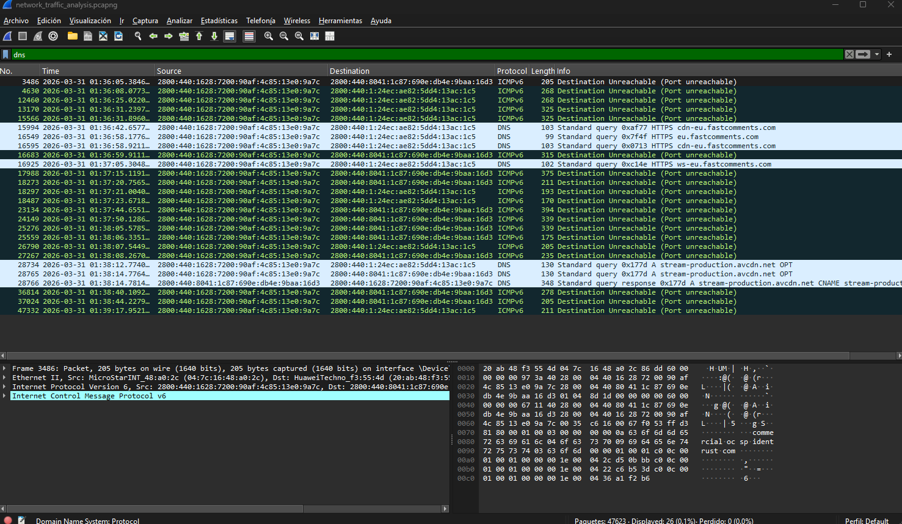
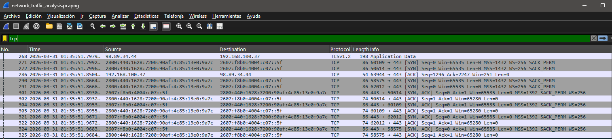
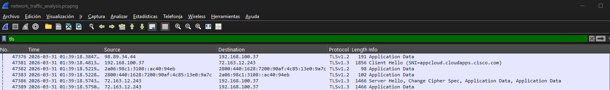

# Network Traffic Analysis with Wireshark

This project demonstrates the analysis of network traffic using Wireshark in a controlled environment.

## Objective

To analyze network traffic and identify protocols such as DNS, TCP, and TLS, as well as understand communication patterns and secure connections.

---

## Tools Used

- Wireshark
- Networking protocols (TCP/IP, DNS, TLS)

---

## Methodology

The analysis followed these steps:

- Packet capture in a live network environment
- DNS traffic analysis
- TCP connection analysis (three-way handshake)
- TLS/HTTPS traffic analysis
- Network conversations analysis

---

## Scan Evidence

### DNS Analysis

---

### TCP Analysis

---

### TLS Analysis

---

### Conversations Analysis

---

## 📄 Report

The full technical report is available in the repository:

`report/wireshark_report.docx`

---

## 👨‍💻 Author

Javier Moreira
